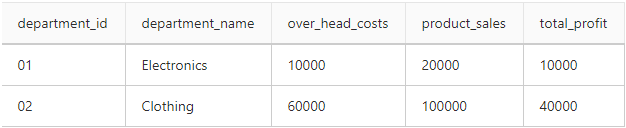

# BAMAZON

## Challenge #1: Customer View (Minimum Requirement)

    1.  Create a MySQL Database called bamazon.

    2.  Then create a Table inside of that database called products.
        The products table should have each of the following columns:

        a.  item_id (unique id for each product)
        b.  product_name (Name of product)
        c.  department_name
        d.  price (cost to customer)
        e.  stock_quantity (how much of the product is available in stores)

    4.  Populate this database with around 10 different products.

    5.  Then create a Node application called bamazonCustomer.js. Running this application will
        a.  first display all of the items available. Include the ids, names, and prices of products
        for sale.

    6.  The app should then prompt users with two messages.
        I.  The first should ask them the ID of the product they would like to buy.
        II. The second message should ask how many units of the product they would like to buy.

    9.  Once the customer has placed the order, your application should check if your store has
    enough of the product to meet the customer's request.

    10. If not, the app should log a phrase like Insufficient quantity!, and then prevent the order
    from going through.

    However, if your store does have enough of the product, you should fulfill the customer's order.

    11. This means updating the SQL database to reflect the remaining quantity.
    Once the update goes through, show the customer the total cost of their purchase.

## Technologies used:

    > mySql
    > inquirer
    > dotenv
    > chalk

## Installation instructions:

    run command

    >npm install

    Copy your 'localhost', 'user' and 'password' information to .env file

# Video Demos

### LeveL #1: bamazonCustomer (Customer's view)

 https://drive.google.com/open?id=13T5Gi0QziNdSTk5xvf4k8QiYwo-9GOvQ

---

## Challenge #2: Manager View (Next Level)

    1.  Create a new Node application called bamazonManager.js. Running this application will:
        List a set of menu options:
    2.  View Products for Sale
    3.  View Low Inventory
    4.  Add to Inventory
    5.  Add New Product

    If a manager selects View Products for Sale, the app should list every available item: the item IDs,
    names, prices, and quantities.

    If a manager selects View Low Inventory, then it should list all items with an inventory count lower
    than five.

    If a manager selects Add to Inventory, your app should display a prompt that will let the manager "add
    more" of any item currently      in the store.

    If a manager selects Add New Product, it should allow the manager to add a completely new product to
    the store.

### Level #2: bamazonManager (Manager's View)

 https://drive.google.com/open?id=1uFshkTAGt3ObqzJx_nTCACgVV6nUV6Ji

---

## Challenge #3: Supervisor View (Final Level)

    1.   Create a new MySQL table called departments. Your table should include the following columns:
        a.  department_id
        b.  department_name
        c.  over_head_costs (A dummy number you set for each department)

    2.  Modify the products table so that there's a product_sales column, and modify your bamazonCustomer.js
    app so that when a customer purchases anything from the store, the price of the product multiplied
    by the quantity purchased is added to the product's product_sales column.

        -  Make sure your app still updates the inventory listed in the products column.

    3.  Create another Node app called bamazonSupervisor.js. Running this application will list a set of
    menu options:

        i.  View Product Sales by Department
        ii.   Create New Department

    4   When a supervisor selects View Product Sales by Department, the app should display a summarized table 
    in their terminal/bash window. Use the table below as a guide.

   

    5.  The total_profit column should be calculated on the fly using the difference between over_head_costs and
    product_sales. total_profit should not be stored in any database. You should use a custom alias.

### Level #3: bamazonSupervisor (Supervisor's View)

 https://drive.google.com/open?id=1uFshkTAGt3ObqzJx_nTCACgVV6nUV6Ji
